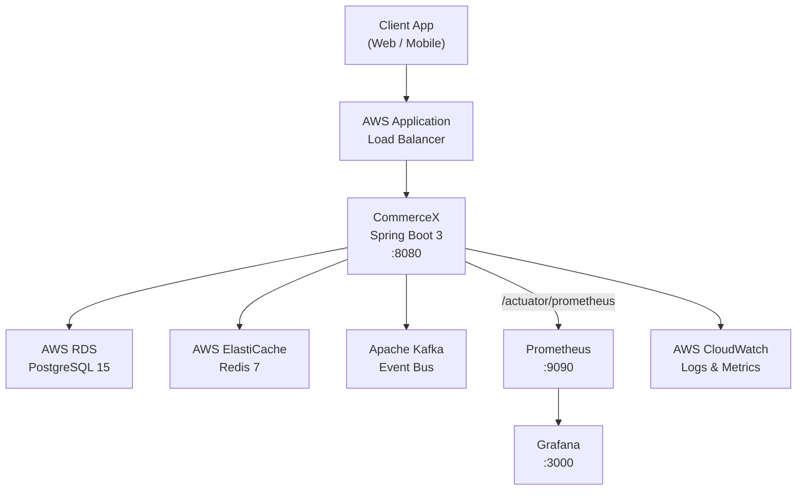
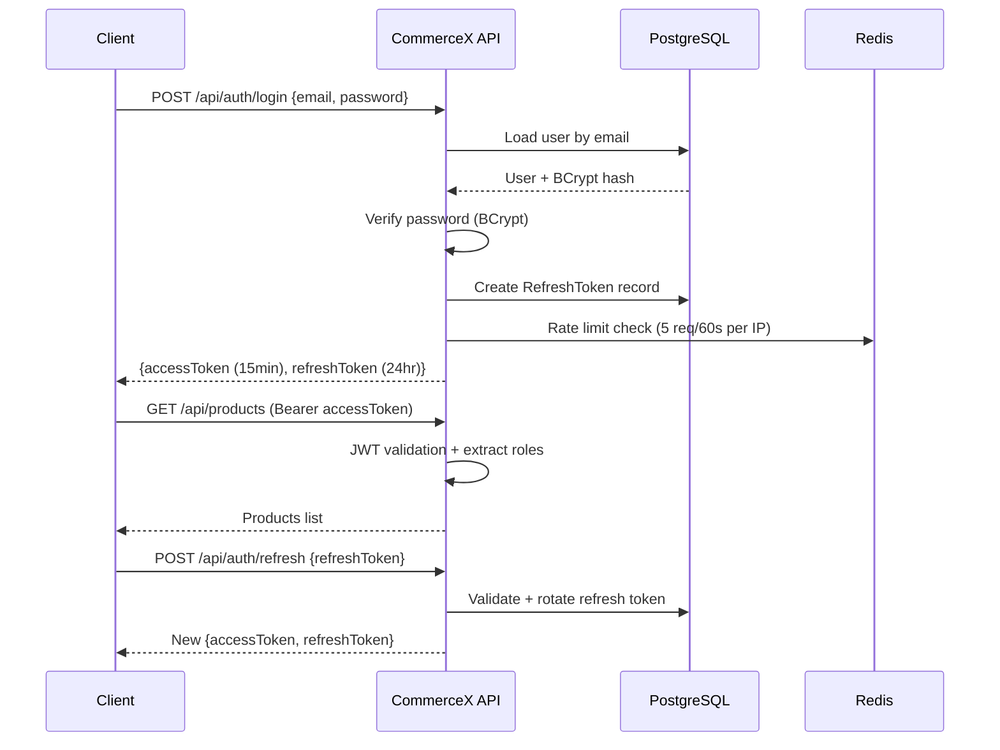
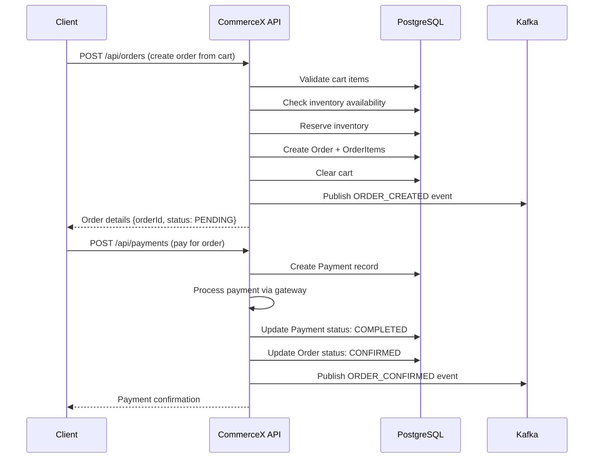
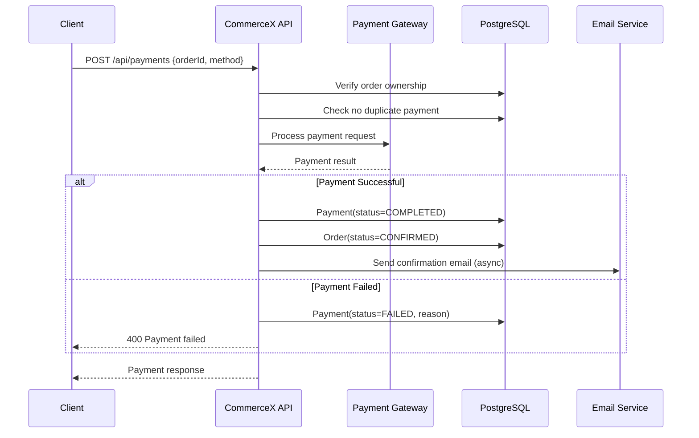
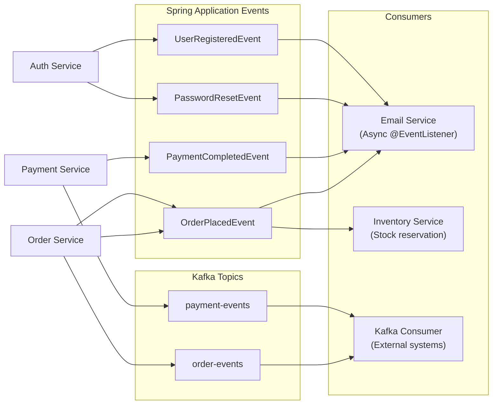
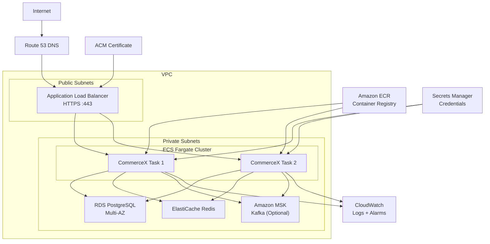

# CommerceX

### Enterprise E-Commerce Backend Platform

**Production-ready REST API for e-commerce — built for scale, security, and observability.**

  
  
  
  

---

## 📋 Table of Contents

1. [Project Overview](#1-project-overview)
2. [Key Features](#2-key-features)
3. [Architecture](#3-architecture)
4. [Tech Stack](#4-tech-stack)
5. [Project Structure](#5-project-structure)
6. [Authentication & Security](#6-authentication--security)
7. [Product Management](#7-product-management)
8. [Inventory Management](#8-inventory-management)
9. [Cart](#9-cart)
10. [Order Management](#10-order-management)
11. [Payment Processing](#11-payment-processing)
12. [Coupon Engine](#12-coupon-engine)
13. [Wishlist](#13-wishlist)
14. [Reviews & Ratings](#14-reviews--ratings)
15. [Advanced Search](#15-advanced-search)
16. [Redis Caching](#16-redis-caching)
17. [Async Processing](#17-async-processing)
18. [Application Events](#18-application-events)
19. [Kafka](#19-kafka)
20. [Docker](#20-docker)
21. [CI/CD](#21-cicd)
22. [Monitoring](#22-monitoring)
23. [AWS Deployment](#23-aws-deployment)
24. [Environment Variables](#24-environment-variables)
25. [Local Setup](#25-local-setup)
26. [API Documentation](#26-api-documentation)
27. [Testing](#27-testing)
28. [Production Deployment](#28-production-deployment)

---

## 1. Project Overview

CommerceX is a **production-ready, enterprise-grade e-commerce backend** built with Spring Boot 3. It provides a complete REST API for running an online store — from product browsing to payment processing — with full observability, event-driven architecture, and AWS cloud deployment support.

**Key design principles:**
- **Security-first**: JWT authentication, RBAC, rate limiting, HTTP security headers
- **Event-driven**: Spring Application Events + Apache Kafka for async processing
- **Observable**: Actuator, Prometheus, Grafana out of the box
- **Cloud-native**: 12-factor app, Docker containers, AWS ECS ready
- **Production-hardened**: HikariCP connection pooling, Redis distributed cache, graceful shutdown, correlation IDs

---

## 2. Key Features

| Category | Features |
|----------|---------|
| **Auth** | JWT access + refresh tokens, BCrypt passwords, token rotation, logout, password reset |
| **Products** | CRUD, category hierarchy, full-text search, pagination, filtering |
| **Inventory** | Real-time stock tracking, reservation system, low-stock alerts |
| **Cart** | Persistent cart, quantity management, coupon application |
| **Orders** | Order lifecycle management, order items, status tracking |
| **Payments** | Payment processing gateway, refund support, duplicate prevention |
| **Coupons** | Percentage and fixed discounts, expiry, usage limits |
| **Wishlist** | Save products for later, move to cart |
| **Reviews** | Star ratings (1-5), text reviews, verified purchase enforcement |
| **Search** | Advanced product search with filtering, sorting, pagination |
| **Security** | Rate limiting, CORS, HSTS, security headers, actuator restriction |
| **Async** | Email notifications, order events via Kafka and Spring events |
| **Caching** | Redis distributed cache for products, categories, coupons |
| **Observability** | Prometheus metrics, Grafana dashboards, health checks |
| **AWS** | ECS Fargate, RDS, ElastiCache, CloudWatch ready |

---

## 3. Architecture

### High-Level Architecture

### Authentication Flow

Click to expand diagram

<a href="#-table-of-contents">⬆ back to top</a>

### Order Flow

Click to expand diagram

<a href="#-table-of-contents">⬆ back to top</a>

### Payment Flow

Click to expand diagram

<a href="#-table-of-contents">⬆ back to top</a>

### Event-Driven Architecture

Click to expand diagram

<a href="#-table-of-contents">⬆ back to top</a>

### AWS Deployment Architecture

Click to expand diagram

<a href="#-table-of-contents">⬆ back to top</a>

---

## 4. Tech Stack

| Layer | Technology | Version |
|-------|-----------|---------|
| **Language** | Java | 17 |
| **Framework** | Spring Boot | 3.2.4 |
| **Security** | Spring Security + JWT (jjwt) | 0.12.5 |
| **Database** | PostgreSQL | 15 |
| **ORM** | Spring Data JPA / Hibernate | 6.4 |
| **DB Migration** | Flyway | 10.x |
| **Cache** | Redis (Lettuce) | 7 |
| **Messaging** | Apache Kafka | 3.7 |
| **Mapping** | MapStruct | 1.5.5 |
| **Validation** | Jakarta Bean Validation | 3.0 |
| **Email** | Spring Mail + Thymeleaf templates | - |
| **API Docs** | Springdoc OpenAPI 3 | 2.5.0 |
| **Monitoring** | Micrometer + Prometheus + Grafana | - |
| **Build**
