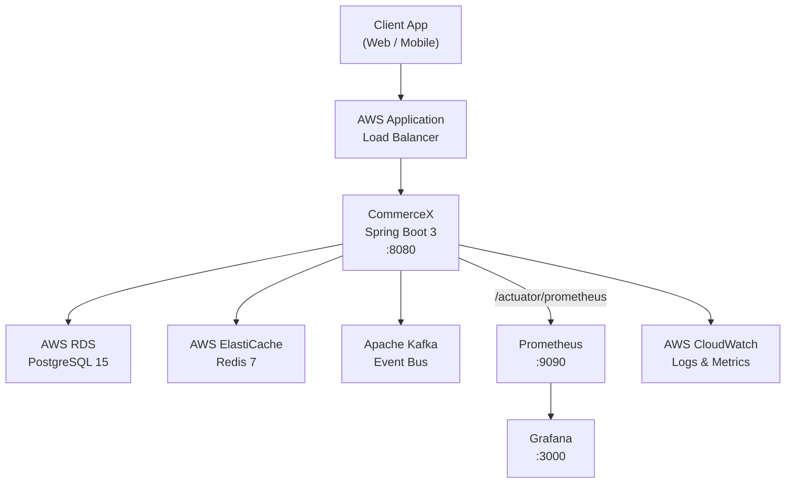
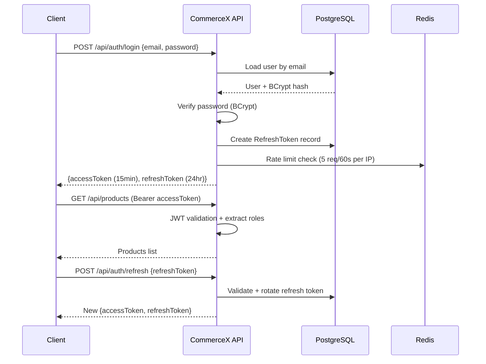
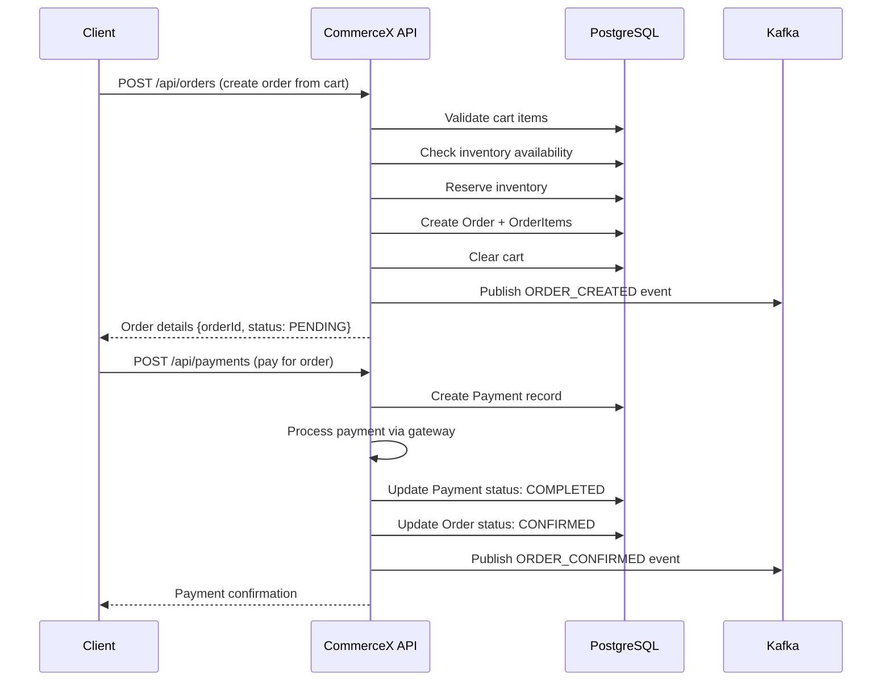
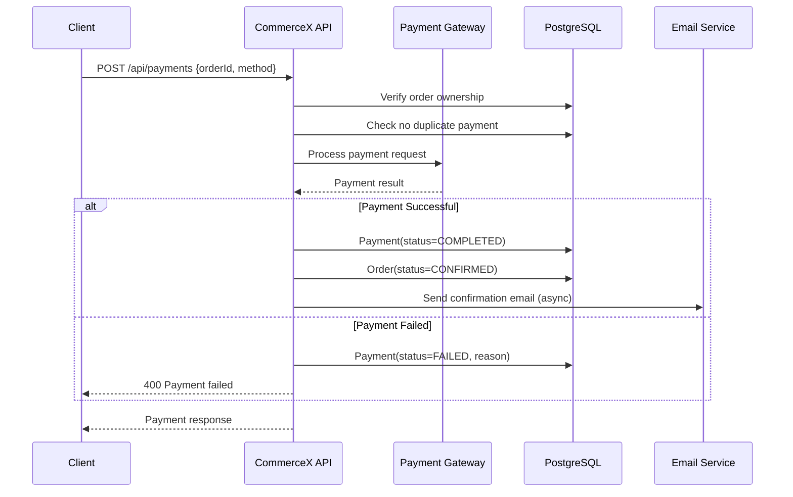
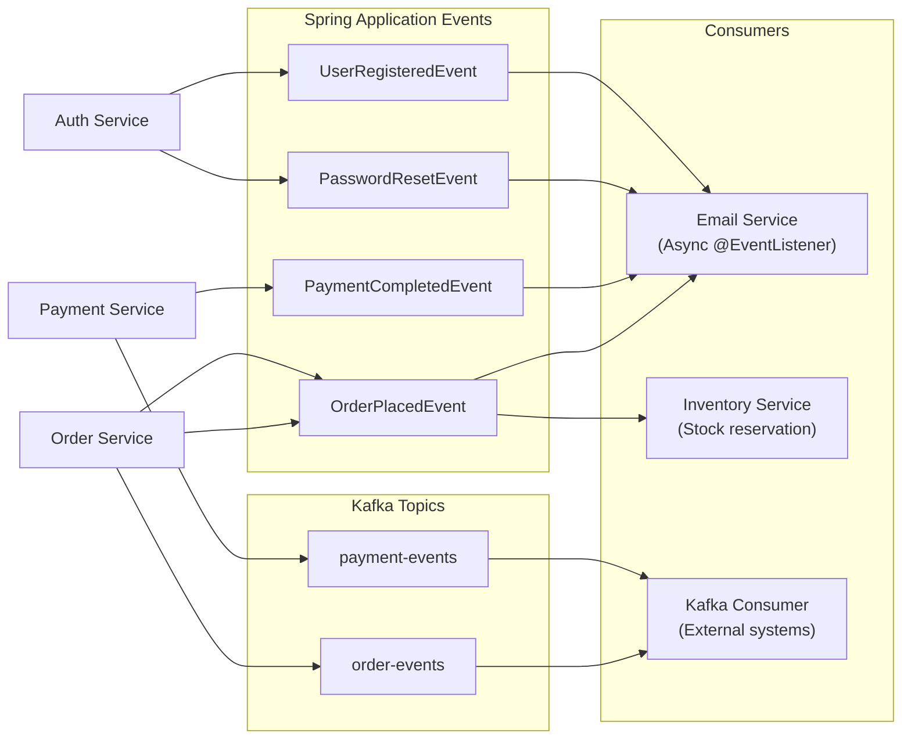
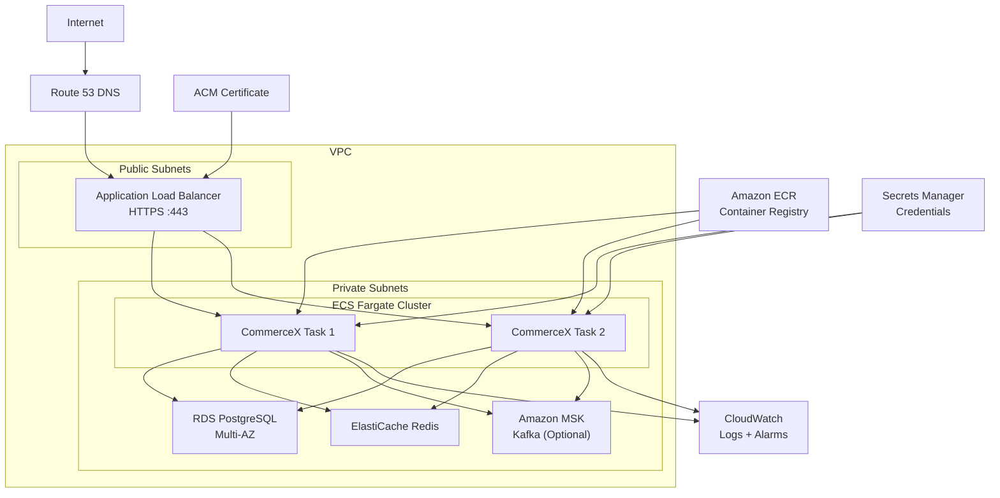

<div align="center">

# CommerceX

### Enterprise E-Commerce Backend Platform

[](https://openjdk.org/)
[](https://spring.io/projects/spring-boot)
[](https://www.postgresql.org/)
[](https://redis.io/)
[](https://kafka.apache.org/)
[](https://docs.docker.com/compose/)
[](https://aws.amazon.com/)
[](LICENSE)

**Production-ready REST API for e-commerce — built for scale, security, and observability.**

</div>

<p align="center">
  <a href="https://e-commerce-x5wo.onrender.com"></a>
  <a href="https://e-commerce-x5wo.onrender.com/swagger-ui.html"></a>
  <a href="https://github.com/nilesh24rit/E-Commerce/issues"></a>
  <a href="https://github.com/nilesh24rit/E-Commerce/issues"></a>
  <a href="https://github.com/nilesh24rit/E-Commerce/stargazers"></a>
  <a href="https://github.com/nilesh24rit/E-Commerce/fork"></a>
</p>

## 🚀 Live Demo

CommerceX is deployed and live on **Render**:

**🔗 Base URL:** [https://e-commerce-x5wo.onrender.com](https://e-commerce-x5wo.onrender.com)
**📖 Swagger UI:** [https://e-commerce-x5wo.onrender.com/swagger-ui.html](https://e-commerce-x5wo.onrender.com/swagger-ui.html)
**❤️ Health Check:** [https://e-commerce-x5wo.onrender.com/actuator/health](https://e-commerce-x5wo.onrender.com/actuator/health)

> **Note:** Deployed on Render's free tier, so the instance spins down after periods of inactivity — the first request after a while may take **30–50 seconds** to wake up (cold start). Kafka is disabled in this deployment to fit free-tier resource limits; the rest of the stack (Auth, Products, Cart, Orders, Payments, Coupons, Wishlist, Reviews, Redis caching) is fully functional.

---

## 📋 Table of Contents

1. [Project Overview](#1-project-overview)
2. [Key Features](#2-key-features)
3. [Architecture](#3-architecture)
4. [Tech Stack](#4-tech-stack)
5. [Project Structure](#5-project-structure)
6. [Authentication & Security](#6-authentication--security)
7. [Product Management](#7-product-management)
8. [Inventory Management](#8-inventory-management)
9. [Cart](#9-cart)
10. [Order Management](#10-order-management)
11. [Payment Processing](#11-payment-processing)
12. [Coupon Engine](#12-coupon-engine)
13. [Wishlist](#13-wishlist)
14. [Reviews & Ratings](#14-reviews--ratings)
15. [Advanced Search](#15-advanced-search)
16. [Redis Caching](#16-redis-caching)
17. [Async Processing](#17-async-processing)
18. [Application Events](#18-application-events)
19. [Kafka](#19-kafka)
20. [Docker](#20-docker)
21. [CI/CD](#21-cicd)
22. [Monitoring](#22-monitoring)
23. [AWS Deployment](#23-aws-deployment)
24. [Environment Variables](#24-environment-variables)
25. [Local Setup](#25-local-setup)
26. [API Documentation](#26-api-documentation)
27. [Testing](#27-testing)
28. [Production Deployment](#28-production-deployment)

---

## 1. Project Overview

CommerceX is a **production-ready, enterprise-grade e-commerce backend** built with Spring Boot 3. It provides a complete REST API for running an online store — from product browsing to payment processing — with full observability, event-driven architecture, and cloud deployment support. It is **[live and deployed on Render](https://e-commerce-x5wo.onrender.com)**, and is designed so the same codebase can also be deployed to AWS ECS with zero code changes — only environment configuration differs.

**Key design principles:**
- **Security-first**: JWT authentication, RBAC, rate limiting, HTTP security headers
- **Event-driven**: Spring Application Events + Apache Kafka for async processing
- **Observable**: Actuator, Prometheus, Grafana out of the box
- **Cloud-native**: 12-factor app, Docker containers, AWS ECS ready
- **Production-hardened**: HikariCP connection pooling, Redis distributed cache, graceful shutdown, correlation IDs

---

## 2. Key Features

| Category | Features |
|----------|---------|
| **Auth** | JWT access + refresh tokens, BCrypt passwords, token rotation, logout, password reset |
| **Products** | CRUD, category hierarchy, full-text search, pagination, filtering |
| **Inventory** | Real-time stock tracking, reservation system, low-stock alerts |
| **Cart** | Persistent cart, quantity management, coupon application |
| **Orders** | Order lifecycle management, order items, status tracking |
| **Payments** | Payment processing gateway, refund support, duplicate prevention |
| **Coupons** | Percentage and fixed discounts, expiry, usage limits |
| **Wishlist** | Save products for later, move to cart |
| **Reviews** | Star ratings (1-5), text reviews, verified purchase enforcement |
| **Search** | Advanced product search with filtering, sorting, pagination |
| **Security** | Rate limiting, CORS, HSTS, security headers, actuator restriction |
| **Async** | Email notifications, order events via Kafka and Spring events |
| **Caching** | Redis distributed cache for products, categories, coupons |
| **Observability** | Prometheus metrics, Grafana dashboards, health checks |
| **AWS** | ECS Fargate, RDS, ElastiCache, CloudWatch ready |

---

## 3. Architecture

### High-Level Architecture



### Authentication Flow

<details>
<summary>Click to expand diagram</summary>



</details>

<div align="right"><a href="#-table-of-contents">⬆ back to top</a></div>

### Order Flow

<details>
<summary>Click to expand diagram</summary>



</details>

<div align="right"><a href="#-table-of-contents">⬆ back to top</a></div>

### Payment Flow

<details>
<summary>Click to expand diagram</summary>



</details>

<div align="right"><a href="#-table-of-contents">⬆ back to top</a></div>

### Event-Driven Architecture

<details>
<summary>Click to expand diagram</summary>



</details>

<div align="right"><a href="#-table-of-contents">⬆ back to top</a></div>

### AWS Deployment Architecture

<details>
<summary>Click to expand diagram</summary>



</details>

<div align="right"><a href="#-table-of-contents">⬆ back to top</a></div>

---

## 4. Tech Stack

| Layer | Technology | Version |
|-------|-----------|---------|
| **Language** | Java | 17 |
| **Framework** | Spring Boot | 3.2.4 |
| **Security** | Spring Security + JWT (jjwt) | 0.12.5 |
| **Database** | PostgreSQL | 15 |
| **ORM** | Spring Data JPA / Hibernate | 6.4 |
| **DB Migration** | Flyway | 10.x |
| **Cache** | Redis (Lettuce) | 7 |
| **Messaging** | Apache Kafka | 3.7 |
| **Mapping** | MapStruct | 1.5.5 |
| **Validation** | Jakarta Bean Validation | 3.0 |
| **Email** | Spring Mail + Thymeleaf templates | - |
| **API Docs** | Springdoc OpenAPI 3 | 2.5.0 |
| **Monitoring** | Micrometer + Prometheus + Grafana | - |
| **Build** | Maven | 3.9.x |
| **Containerization** | Docker (multi-stage build) | - |
| **Deployment** | Render (live), AWS ECS Fargate (ready) | - |

<div align="right"><a href="#-table-of-contents">⬆ back to top</a></div>

---

## 5. Project Structure

```
src/main/java/com/commercex/
├── auth/            # Auth-related beans (JWT provider, user details service)
├── config/          # Security, CORS, Redis, Kafka, OpenAPI, rate-limit config
├── controller/       # REST controllers (Auth, Product, Cart, Order, Payment,
│                      Coupon, Wishlist, Review, Category, Inventory, Admin)
├── dto/              # Request/response DTOs
├── entity/           # JPA entities + enums
├── event/            # Spring application events + Kafka publishers/listeners
├── exception/        # Global exception handling
├── mapper/           # MapStruct mappers (entity <-> DTO)
├── repository/       # Spring Data JPA repositories
├── scheduling/       # Scheduled jobs (e.g. coupon expiry, cleanup)
├── security/         # JWT filter, auth entry point, RBAC
└── service/           # Business logic + gateway integrations (impl packages)

src/main/resources/
├── application.yml         # Common config (profile-driven via env vars)
├── application-dev.yml     # Local/dev profile
├── application-prod.yml    # Production profile (Flyway validate, SASL Kafka, etc.)
├── db/                     # Flyway migrations
└── templates/              # Thymeleaf email templates
```

<div align="right"><a href="#-table-of-contents">⬆ back to top</a></div>

---

## 6. Authentication & Security

- **JWT-based auth** — short-lived access tokens (15 min) + rotating refresh tokens (24 hr), signed and validated per `app.jwt.*` config.
- **BCrypt** password hashing; passwords are never stored or logged in plain text.
- **Role-based access control (RBAC)** on controller endpoints (e.g. admin-only inventory/coupon management).
- **Rate limiting** on login and registration endpoints (configurable max requests per time window via Redis).
- **CORS** restricted to configured allowed origins (`app.cors.allowed-origins`).
- **Security headers**: HSTS and other hardening headers enabled by Spring Security config.
- **Actuator restriction** — only `health`, `info`, `metrics`, `prometheus` are exposed; sensitive endpoints stay closed, and error responses never leak stack traces in prod.

<div align="right"><a href="#-table-of-contents">⬆ back to top</a></div>

---

## 7. Product Management

Full CRUD for products with category hierarchy support, pagination, filtering, and full-text search via `ProductController` / `CategoryController`. Product data is cached in Redis to reduce database load on high-traffic read paths.

<div align="right"><a href="#-table-of-contents">⬆ back to top</a></div>

---

## 8. Inventory Management

`InventoryController` tracks real-time stock per product, reserves inventory at order-creation time (before payment confirms), and supports low-stock alerting so overselling is prevented even under concurrent checkouts.

<div align="right"><a href="#-table-of-contents">⬆ back to top</a></div>

---

## 9. Cart

`CartController` manages a persistent, per-user cart — add/update/remove items, quantity changes, and coupon application before checkout.

<div align="right"><a href="#-table-of-contents">⬆ back to top</a></div>

---

## 10. Order Management

`OrderController` handles the full order lifecycle: cart validation → inventory check/reservation → order + order-item creation → cart clearing → `ORDER_CREATED` event. See the [Order Flow diagram](#order-flow) above.

<div align="right"><a href="#-table-of-contents">⬆ back to top</a></div>

---

## 11. Payment Processing

`PaymentController` processes payments against a pluggable payment gateway abstraction (`service/gateway`), with duplicate-payment prevention and refund support. On success, the order is confirmed and a confirmation email is sent asynchronously. See the [Payment Flow diagram](#payment-flow) above.

<div align="right"><a href="#-table-of-contents">⬆ back to top</a></div>

---

## 12. Coupon Engine

`CouponController` supports percentage and fixed-value discounts, expiry dates, and usage limits, applied at cart/checkout time and cached in Redis.

<div align="right"><a href="#-table-of-contents">⬆ back to top</a></div>

---

## 13. Wishlist

`WishlistController` lets users save products for later and move them into the cart when ready to buy.

<div align="right"><a href="#-table-of-contents">⬆ back to top</a></div>

---

## 14. Reviews & Ratings

`ReviewController` supports 1–5 star ratings with text reviews, restricted to verified purchasers.

<div align="right"><a href="#-table-of-contents">⬆ back to top</a></div>

---

## 15. Advanced Search

Product search supports filtering (category, price range, etc.), sorting, and pagination, backed by JPA specifications/queries.

<div align="right"><a href="#-table-of-contents">⬆ back to top</a></div>

---

## 16. Redis Caching

Products, categories, and coupons are cached in Redis (Lettuce client) to cut down repeated DB hits on hot read paths, with pool sizing tuned differently for dev vs prod (`application-prod.yml` widens the connection pool).

<div align="right"><a href="#-table-of-contents">⬆ back to top</a></div>

---

## 17. Async Processing

Email notifications (order confirmations, password reset, etc.) are sent asynchronously via `@EventListener` + Spring's async executor, so request threads aren't blocked on SMTP calls.

<div align="right"><a href="#-table-of-contents">⬆ back to top</a></div>

---

## 18. Application Events

Domain events (`OrderPlacedEvent`, `PaymentCompletedEvent`, `PasswordResetEvent`, `UserRegisteredEvent`) decouple side effects (emails, inventory updates) from the core request flow. See the [Event-Driven Architecture diagram](#event-driven-architecture) above.

<div align="right"><a href="#-table-of-contents">⬆ back to top</a></div>

---

## 19. Kafka

`order-events` and `payment-events` topics let external systems consume order/payment activity independently of the main request path. Kafka health check is **disabled** (`management.health.kafka.enabled: false`) so the app stays healthy even when Kafka isn't reachable — this is what allows CommerceX to run on Render's free tier with Kafka switched off, while remaining fully Kafka-ready for environments where it's provisioned (e.g. AWS MSK in prod, via SASL_SSL).

<div align="right"><a href="#-table-of-contents">⬆ back to top</a></div>

---

## 20. Docker

A multi-stage `Dockerfile` builds the app with Maven on `eclipse-temurin:17` and ships a slim `eclipse-temurin:17-jre-alpine` runtime image running as a non-root user, with a built-in `HEALTHCHECK` against `/actuator/health` and G1GC-tuned JVM flags. `docker-compose.yml` spins up the app alongside PostgreSQL, Redis, Kafka, Prometheus, and Grafana for local development.

```bash
docker compose up --build
```

<div align="right"><a href="#-table-of-contents">⬆ back to top</a></div>

---

## 21. CI/CD

GitHub Actions workflows (`.github/workflows`) build and validate the project on push, keeping `main` deployable at all times.

<div align="right"><a href="#-table-of-contents">⬆ back to top</a></div>

---

## 22. Monitoring

- **Micrometer + Prometheus** — metrics exposed at `/actuator/prometheus`.
- **Grafana** — pre-provisioned dashboard (`grafana/dashboards/commercex-dashboard.json`) and datasource, spun up automatically via `docker-compose.yml`.
- **Actuator health** — `/actuator/health` reports DB and Redis status (Kafka health check disabled by design, see [§19](#19-kafka)).

<div align="right"><a href="#-table-of-contents">⬆ back to top</a></div>

---

## 23. AWS Deployment

The app is 12-factor and container-ready for **AWS ECS Fargate**, backed by **RDS PostgreSQL**, **ElastiCache Redis**, and optionally **Amazon MSK** for Kafka — see [`docs/aws-deployment-guide.md`](docs/aws-deployment-guide.md) for the full walkthrough and the [AWS Deployment Architecture diagram](#aws-deployment-architecture) above. The current live instance is deployed on **Render** instead, using the same Docker image, for a lighter-weight always-on free-tier demo.

<div align="right"><a href="#-table-of-contents">⬆ back to top</a></div>

---

## 24. Environment Variables

All configuration is externalized — nothing is hardcoded. Key variables (see `application.yml` / `application-prod.yml`):

| Variable | Purpose |
|----------|---------|
| `SPRING_PROFILES_ACTIVE` | `dev` or `prod` |
| `PORT` | Server port (defaults to `8080`; Render injects this) |
| `SPRING_DATASOURCE_URL` / `USERNAME` / `PASSWORD` | PostgreSQL connection |
| `DB_POOL_MAX_SIZE` / `DB_POOL_MIN_IDLE` / `DB_CONNECTION_TIMEOUT_MS` | HikariCP tuning |
| `SPRING_REDIS_HOST` / `PORT` / `PASSWORD` / `TIMEOUT_MS` | Redis connection |
| `SPRING_KAFKA_BOOTSTRAP_SERVERS`, `KAFKA_CONSUMER_GROUP_ID` | Kafka (optional — can be left unset/disabled) |
| `KAFKA_SECURITY_PROTOCOL` / `KAFKA_SASL_MECHANISM` / `KAFKA_SASL_JAAS_CONFIG` | Kafka SASL_SSL (prod only, e.g. AWS MSK) |
| `SPRING_MAIL_HOST` / `PORT` / `USERNAME` / `PASSWORD` | SMTP for transactional email |
| `JWT_SECRET`, `JWT_EXPIRATION_MS`, `JWT_REFRESH_EXPIRATION_MS` | JWT signing & expiry |
| `CORS_ALLOWED_ORIGINS` | Allowed frontend origin(s) |
| `RATE_LIMIT_ENABLED`, `RATE_LIMIT_LOGIN_MAX`, `RATE_LIMIT_LOGIN_WINDOW`, `RATE_LIMIT_REGISTER_MAX`, `RATE_LIMIT_REGISTER_WINDOW` | Login/registration rate limiting |

<div align="right"><a href="#-table-of-contents">⬆ back to top</a></div>

---

## 25. Local Setup

```bash
# 1. Clone the repo
git clone https://github.com/nilesh24rit/E-Commerce.git
cd E-Commerce

# 2. Start dependencies (Postgres, Redis, Kafka, Prometheus, Grafana)
docker compose up -d

# 3. Set required environment variables (see §24), then run
mvn clean package -DskipTests
java -jar target/commercex-0.0.1-SNAPSHOT.jar

# App will be available at:
# http://localhost:8080
```

<div align="right"><a href="#-table-of-contents">⬆ back to top</a></div>

---

## 26. API Documentation

Interactive Swagger UI (Springdoc OpenAPI 3) is available at `/swagger-ui.html`, with the raw OpenAPI spec at `/v3/api-docs`.

- **Live:** [https://e-commerce-x5wo.onrender.com/swagger-ui.html](https://e-commerce-x5wo.onrender.com/swagger-ui.html)
- **Local:** `http://localhost:8080/swagger-ui.html`

<div align="right"><a href="#-table-of-contents">⬆ back to top</a></div>

---

## 27. Testing

Unit and integration tests live under `src/test/java`. Run them with:

```bash
mvn test
```

> During Docker image builds, tests are skipped (`-DskipTests`) since integration tests require live Kafka/DB context that isn't available at build time — see `Dockerfile`.

<div align="right"><a href="#-table-of-contents">⬆ back to top</a></div>

---

## 28. Production Deployment

**Currently deployed on [Render](https://e-commerce-x5wo.onrender.com)** using the project's Docker image, with:
- `SPRING_PROFILES_ACTIVE=prod` (Flyway migrations validated, not auto-run destructively)
- Managed PostgreSQL and Redis add-ons
- Kafka **disabled** to stay within free-tier resource limits (see [§19](#19-kafka))
- Error responses stripped of stack traces / internal details (`server.error.*` in `application-prod.yml`)

A full checklist for hardened production rollouts (including the AWS path) is in [`docs/production-checklist.md`](docs/production-checklist.md).

<div align="right"><a href="#-table-of-contents">⬆ back to top</a></div>

---

<div align="center">

Built by **[Nilesh](https://github.com/nilesh24rit)** — feel free to ⭐ the repo if you find it useful!

</div>
