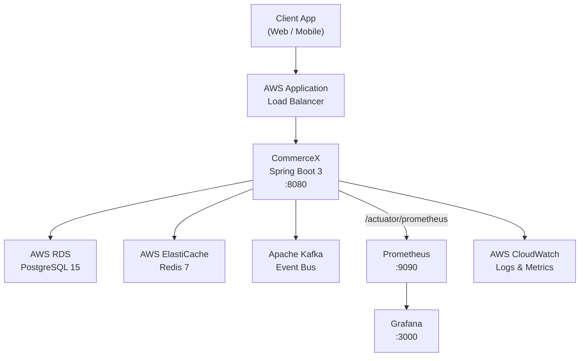
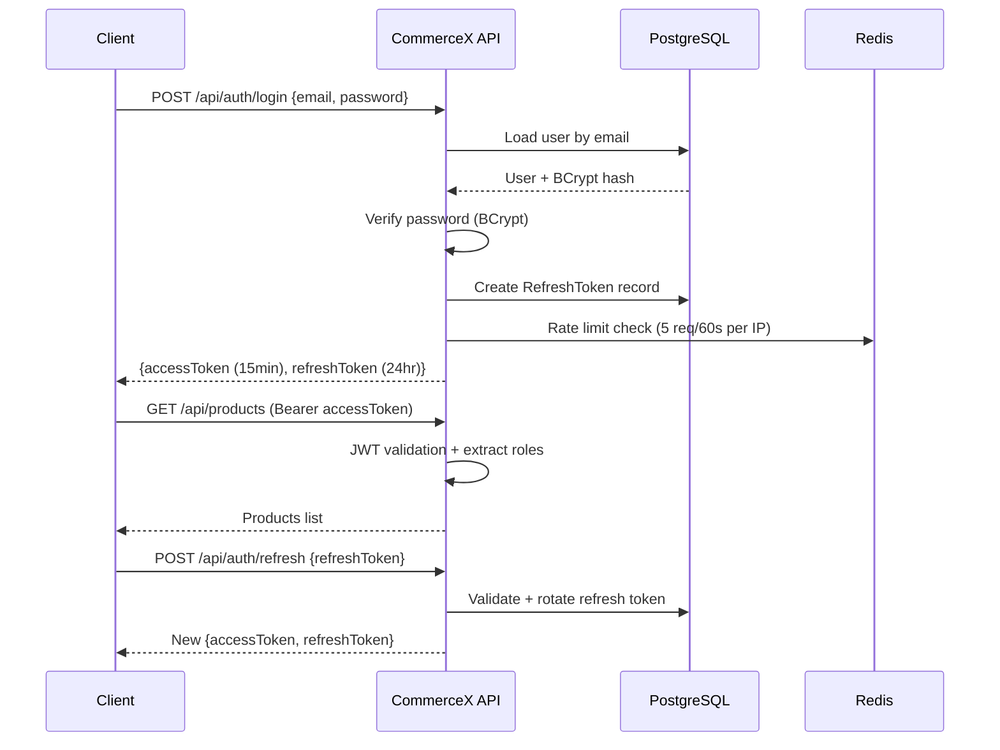
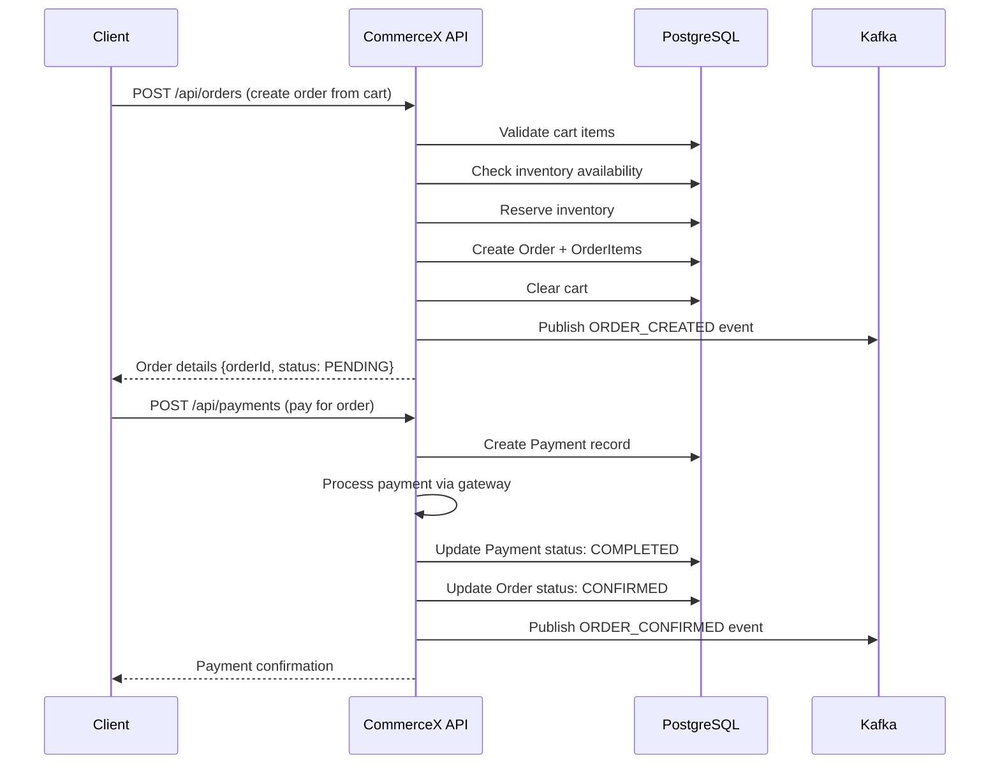
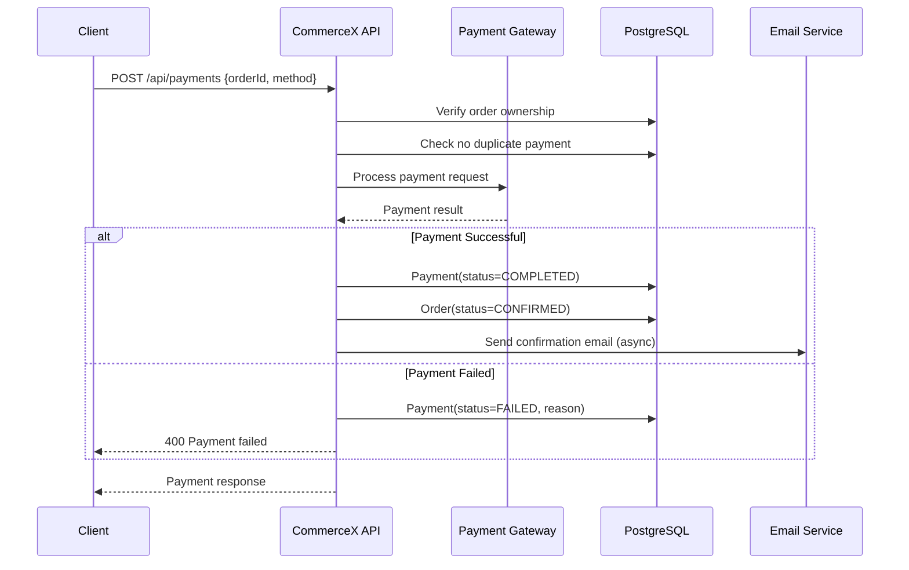
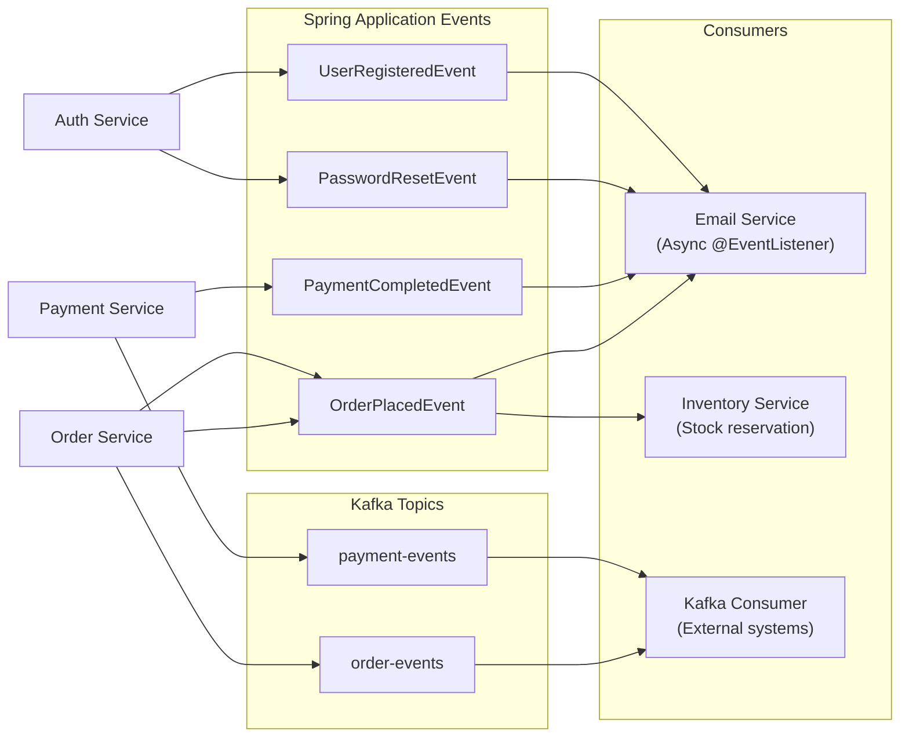
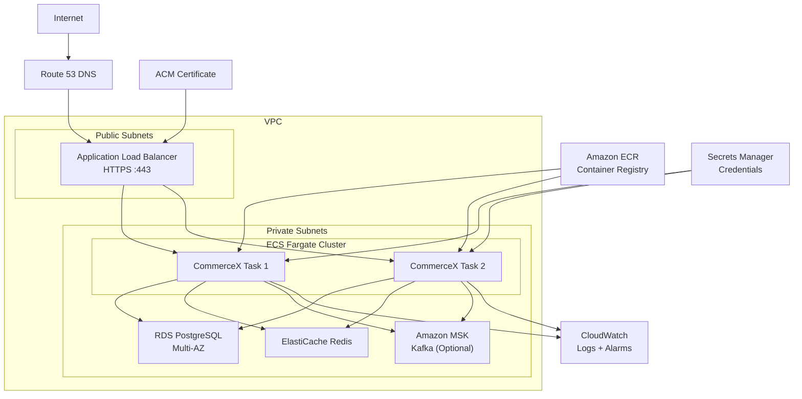

<div align="center">

# CommerceX

### Enterprise E-Commerce Backend Platform

[](https://openjdk.org/)
[](https://spring.io/projects/spring-boot)
[](https://www.postgresql.org/)
[](https://redis.io/)
[](https://kafka.apache.org/)
[](https://docs.docker.com/compose/)
[](https://aws.amazon.com/)
[](LICENSE)

**Production-ready REST API for e-commerce — built for scale, security, and observability.**

</div>

---

## 📋 Table of Contents

1. [Project Overview](#1-project-overview)
2. [Key Features](#2-key-features)
3. [Architecture](#3-architecture)
4. [Tech Stack](#4-tech-stack)
5. [Project Structure](#5-project-structure)
6. [Authentication & Security](#6-authentication--security)
7. [Product Management](#7-product-management)
8. [Inventory Management](#8-inventory-management)
9. [Cart](#9-cart)
10. [Order Management](#10-order-management)
11. [Payment Processing](#11-payment-processing)
12. [Coupon Engine](#12-coupon-engine)
13. [Wishlist](#13-wishlist)
14. [Reviews & Ratings](#14-reviews--ratings)
15. [Advanced Search](#15-advanced-search)
16. [Redis Caching](#16-redis-caching)
17. [Async Processing](#17-async-processing)
18. [Application Events](#18-application-events)
19. [Kafka](#19-kafka)
20. [Docker](#20-docker)
21. [CI/CD](#21-cicd)
22. [Monitoring](#22-monitoring)
23. [AWS Deployment](#23-aws-deployment)
24. [Environment Variables](#24-environment-variables)
25. [Local Setup](#25-local-setup)
26. [API Documentation](#26-api-documentation)
27. [Testing](#27-testing)
28. [Production Deployment](#28-production-deployment)

---

## 1. Project Overview

CommerceX is a **production-ready, enterprise-grade e-commerce backend** built with Spring Boot 3. It provides a complete REST API for running an online store — from product browsing to payment processing — with full observability, event-driven architecture, and AWS cloud deployment support.

**Key design principles:**
- **Security-first**: JWT authentication, RBAC, rate limiting, HTTP security headers
- **Event-driven**: Spring Application Events + Apache Kafka for async processing
- **Observable**: Actuator, Prometheus, Grafana out of the box
- **Cloud-native**: 12-factor app, Docker containers, AWS ECS ready
- **Production-hardened**: HikariCP connection pooling, Redis distributed cache, graceful shutdown, correlation IDs

---

## 2. Key Features

| Category | Features |
|----------|---------|
| **Auth** | JWT access + refresh tokens, BCrypt passwords, token rotation, logout, password reset |
| **Products** | CRUD, category hierarchy, full-text search, pagination, filtering |
| **Inventory** | Real-time stock tracking, reservation system, low-stock alerts |
| **Cart** | Persistent cart, quantity management, coupon application |
| **Orders** | Order lifecycle management, order items, status tracking |
| **Payments** | Payment processing gateway, refund support, duplicate prevention |
| **Coupons** | Percentage and fixed discounts, expiry, usage limits |
| **Wishlist** | Save products for later, move to cart |
| **Reviews** | Star ratings (1-5), text reviews, verified purchase enforcement |
| **Search** | Advanced product search with filtering, sorting, pagination |
| **Security** | Rate limiting, CORS, HSTS, security headers, actuator restriction |
| **Async** | Email notifications, order events via Kafka and Spring events |
| **Caching** | Redis distributed cache for products, categories, coupons |
| **Observability** | Prometheus metrics, Grafana dashboards, health checks |
| **AWS** | ECS Fargate, RDS, ElastiCache, CloudWatch ready |

---

## 3. Architecture

### High-Level Architecture



### Authentication Flow



### Order Flow



### Payment Flow



### Event-Driven Architecture



### AWS Deployment Architecture



---

## 4. Tech Stack

| Layer | Technology | Version |
|-------|-----------|---------|
| **Language** | Java | 17 |
| **Framework** | Spring Boot | 3.2.4 |
| **Security** | Spring Security + JWT (jjwt) | 0.12.5 |
| **Database** | PostgreSQL | 15 |
| **ORM** | Spring Data JPA / Hibernate | 6.4 |
| **DB Migration** | Flyway | 10.x |
| **Cache** | Redis (Lettuce) | 7 |
| **Messaging** | Apache Kafka | 3.7 |
| **Mapping** | MapStruct | 1.5.5 |
| **Validation** | Jakarta Bean Validation | 3.0 |
| **Email** | Spring Mail + Thymeleaf templates | - |
| **API Docs** | Springdoc OpenAPI 3 | 2.5.0 |
| **Monitoring** | Micrometer + Prometheus + Grafana | - |
| **Build** | Maven | 3.8+ |
| **Container** | Docker + Docker Compose | 24.0+ |
| **Utilities** | Lombok, MapStruct | - |

---

## 5. Project Structure

```
commercex/
├── src/
│   ├── main/
│   │   ├── java/com/commercex/
│   │   │   ├── auth/              # Authentication service
│   │   │   ├── config/            # Redis, Async, JPA, OpenAPI, BusinessMetrics
│   │   │   ├── controller/        # REST controllers (11 controllers)
│   │   │   ├── dto/               # Request/Response DTOs
│   │   │   ├── entity/            # JPA Entities
│   │   │   ├── event/             # Spring Application Events
│   │   │   ├── exception/         # Custom exceptions + GlobalExceptionHandler
│   │   │   ├── mapper/            # MapStruct mappers
│   │   │   ├── repository/        # Spring Data JPA repositories
│   │   │   ├── scheduler/         # Scheduled tasks
│   │   │   ├── security/          # JWT, filters, security config
│   │   │   └── service/           # Business logic services
│   │   └── resources/
│   │       ├── application.yml        # Base configuration
│   │       ├── application-dev.yml    # Development profile
│   │       ├── application-prod.yml   # Production profile
│   │       ├── db/migration/          # Flyway SQL migrations
│   │       └── templates/             # Thymeleaf email templates
│   └── test/
│       └── java/com/commercex/       # Unit & integration tests
├── docs/
│   ├── aws-deployment-guide.md        # AWS ECS deployment guide
│   └── production-checklist.md       # Pre-deployment checklist
├── prometheus/
│   └── prometheus.yml                 # Prometheus scrape config
├── grafana/
│   ├── provisioning/                  # Auto-provision datasource
│   └── dashboards/                    # Pre-built Grafana dashboards
├── .github/
│   └── workflows/ci.yml              # GitHub Actions CI pipeline
├── Dockerfile                         # Multi-stage production Docker build
├── docker-compose.yml                 # Full local stack
├── .env.example                       # Environment variable template
└── pom.xml                            # Maven build descriptor
```

---

## 6. Authentication & Security

### JWT Token Strategy
- **Access Token**: Short-lived (15 minutes), stateless JWT containing userId, roles
- **Refresh Token**: Long-lived (24 hours), stored in PostgreSQL, rotated on every use
- **Token Type Claim**: Prevents refresh tokens from being used as access tokens
- **Issuer + Audience Validation**: Prevents token misuse across different services

### Security Layers
| Layer | Implementation |
|-------|---------------|
| Password hashing | BCrypt (strength 12) |
| Transport | HTTPS enforced (HSTS, Strict-Transport-Security) |
| CORS | Configured per environment (restricted in production) |
| CSRF | Disabled (stateless JWT API is not vulnerable) |
| Session | STATELESS (no server-side sessions) |
| Headers | X-Frame-Options: DENY, X-Content-Type-Options: nosniff |
| Actuator | `/actuator/health` + `/actuator/info` public; rest requires ROLE_ADMIN |
| Rate Limiting | Redis-backed sliding window (5 login / 3 register per 60s per IP) |
| Correlation IDs | Every request tagged with UUID for end-to-end tracing |

### RBAC
| Role | Permissions |
|------|-------------|
| `ROLE_CUSTOMER` | Own profile, own orders, own cart, own wishlist, own reviews |
| `ROLE_ADMIN` | All customer permissions + product/inventory/category/coupon admin |
| `ROLE_SELLER` | Product management (future expansion) |

---

## 7. Product Management

- Create, read, update, deactivate products
- Category assignment and browsing
- SKU-based unique identification
- Soft delete via `active=false` flag
- Redis caching (10-minute TTL)
- Paginated listing with sorting

**Endpoints:** `GET/POST/PUT/DELETE /api/products/**`

---

## 8. Inventory Management

- Track available quantity and reserved quantity per product
- Reserve stock on order creation, release on cancellation
- Low-stock threshold alerts via application events
- Atomic operations with optimistic locking

**Endpoints:** `GET/POST/PUT /api/inventory/**`

---

## 9. Cart

- Persistent cart per user (database-backed)
- Add, update quantity, remove items
- Apply/remove coupons
- Cart → Order conversion
- Cart cleared on successful order placement

**Endpoints:** `GET/POST/PUT/DELETE /api/cart/**`

---

## 10. Order Management

- Create order from active cart
- Order status lifecycle: `PENDING → CONFIRMED → PROCESSING → SHIPPED → DELIVERED → CANCELLED`
- Order history with pagination
- Role-based: customers see only their own orders

**Endpoints:** `GET/POST/PUT /api/orders/**`

---

## 11. Payment Processing

- Create payment for an order
- Duplicate payment prevention (idempotency)
- Payment status: `PENDING → COMPLETED | FAILED`
- Refund request support
- Transaction ID and failure reason tracking

**Endpoints:** `GET/POST /api/payments/**`

---

## 12. Coupon Engine

- Fixed and percentage discounts
- Minimum order value enforcement
- Maximum usage limit per coupon
- Expiry date validation
- Active/inactive coupon management
- Per-order coupon application

**Endpoints:** `GET/POST/PUT/DELETE /api/coupons/**`

---

## 13. Wishlist

- One wishlist per user
- Add/remove products
- Duplicate prevention
- Paginated wishlist view

**Endpoints:** `GET/POST/DELETE /api/wishlist/**`

---

## 14. Reviews & Ratings

- Star ratings 1-5
- Text review/comment
- One review per user per product
- Review eligibility enforcement (requires purchase)
- Average rating calculation per product

**Endpoints:** `GET/POST/PUT/DELETE /api/reviews/**`

---

## 15. Advanced Search

- Full-text product name and description search
- Filter by category, price range, availability
- Sort by: name, price, rating, newest
- Paginated results
- Search count tracked as a business metric

**Endpoints:** `GET /api/products/search`

---

## 16. Redis Caching

| Cache Name | TTL | Contents |
|-----------|-----|----------|
| `products` | 10 minutes | Product listings and individual products |
| `categories` | 30 minutes | Category tree |
| `coupons` | 5 minutes | Active coupon data |
| Default | 60 minutes | Other cacheable data |

Cache is invalidated on write operations (CacheEvict). Uses Lettuce connection pool.

---

## 17. Async Processing

Spring Boot `@Async` is used for non-blocking operations:
- **Email sending**: Order confirmation, password reset, registration welcome
- **Inventory alerts**: Low-stock notifications to admins
- **Scheduled cleanup**: Expired refresh token purging (runs nightly)

---

## 18. Application Events

Spring `ApplicationEventPublisher` events for internal decoupling:

| Event | Publisher | Consumer |
|-------|----------|---------|
| `OrderPlacedEvent` | OrderService | EmailService (async) |
| `PaymentCompletedEvent` | PaymentService | EmailService (async) |
| `PasswordResetEvent` | UserService | EmailService (async) |
| `UserRegisteredEvent` | AuthService | EmailService (async) |
| `LowStockEvent` | InventoryService | EmailService (async) |

---

## 19. Kafka

Apache Kafka is used for external event streaming (integrating with downstream systems):

| Topic | Published By | Description |
|-------|-------------|-------------|
| `order-events` | OrderService | Order lifecycle events |
| `payment-events` | PaymentService | Payment status changes |

**Local**: KRaft mode (no ZooKeeper), via Docker Compose.
**Production**: AWS MSK with SASL_SSL security.

Switch from local to production by setting:
```
KAFKA_SECURITY_PROTOCOL=SASL_SSL
KAFKA_SASL_JAAS_CONFIG=<your-msk-jaas-config>
```

---

## 20. Docker

### Services

| Service | Image | Port |
|---------|-------|------|
| commercex | Custom (multi-stage) | 8080 |
| postgres | postgres:15-alpine | 5432 |
| redis | redis:7-alpine | 6379 |
| kafka | apache/kafka:3.7.0 | 9092 |
| prometheus | prom/prometheus:v2.51.0 | 9090 |
| grafana | grafana/grafana:10.4.0 | 3000 |

### Docker Security
- Non-root user (`commercex`) in container
- Multi-stage build (Maven builder → JRE runtime, no SDK in prod image)
- JVM flags: G1GC, MaxRAMPercentage=75%, ExitOnOutOfMemoryError
- Health check defined in Dockerfile and docker-compose

---

## 21. CI/CD

GitHub Actions pipeline at [`.github/workflows/ci.yml`](.github/workflows/ci.yml):

```
┌─────────────┐    ┌──────────────┐    ┌─────────────┐    ┌──────────────┐
│  Checkout   │ →  │  Setup JDK   │ →  │  mvn test   │ →  │ mvn package  │
│             │    │  17 + Maven  │    │             │    │              │
└─────────────┘    └──────────────┘    └─────────────┘    └──────────────┘
                                                                   │
                                                          ┌────────────────┐
                                                          │  docker build  │
                                                          │  (validate)    │
                                                          └────────────────┘
```

---

## 22. Monitoring

### Endpoints

| Endpoint | Description |
|----------|-------------|
| `GET /actuator/health` | Application + dependency health |
| `GET /actuator/info` | Application info |
| `GET /actuator/prometheus` | Prometheus metrics scrape |
| `http://localhost:9090` | Prometheus server |
| `http://localhost:3000` | Grafana (admin/admin) |

### Business Metrics (Prometheus)

| Metric | Description |
|--------|-------------|
| `commercex.orders.created` | Total orders created |
| `commercex.payments.successful` | Successful payments |
| `commercex.payments.failed` | Failed payment attempts |
| `commercex.product.searches` | Product search queries |
| `commercex.cart.items.added` | Items added to cart |
| `commercex.cart.items.removed` | Items removed from cart |
| `commercex.coupons.applied` | Coupon applications |
| `commercex.users.registered` | User registrations |
| `commercex.reviews.submitted` | Reviews submitted |

### Infrastructure Metrics (JVM/HTTP)
- `http_server_requests_seconds_*` — Request rate and latency
- `jvm_memory_used_bytes` — JVM heap usage
- `hikaricp_connections_active` — Active DB connections
- `system_cpu_usage` — CPU usage

Grafana auto-provisions Prometheus datasource and loads the CommerceX dashboard.

---

## 23. AWS Deployment

See full guide in [`docs/aws-deployment-guide.md`](docs/aws-deployment-guide.md).

**Summary**: CommerceX is designed for AWS ECS Fargate deployment with:
- Application Load Balancer (HTTPS, ACM certificate)
- RDS PostgreSQL Multi-AZ (private subnet)
- ElastiCache Redis (private subnet)
- Amazon MSK Kafka (optional)
- CloudWatch logs and alarms
- Secrets Manager for all credentials
- Auto-scaling based on CPU utilization

> **Note**: Actual AWS deployment requires AWS credentials, an active AWS account, and provisioned infrastructure. No AWS resources are claimed to exist — this is deployment-ready configuration.

---

## 24. Environment Variables

| Variable | Default | Description |
|----------|---------|-------------|
| `SPRING_PROFILES_ACTIVE` | `dev` | Active profile (`dev` or `prod`) |
| `SERVER_PORT` | `8080` | Application port |
| `SPRING_DATASOURCE_URL` | `jdbc:postgresql://localhost:5432/commercex` | Database URL |
| `SPRING_DATASOURCE_USERNAME` | `postgres` | DB username |
| `SPRING_DATASOURCE_PASSWORD` | `password` | DB password |
| `DB_POOL_MAX_SIZE` | `10` | HikariCP max connections |
| `DB_POOL_MIN_IDLE` | `2` | HikariCP min idle connections |
| `SPRING_REDIS_HOST` | `localhost` | Redis host |
| `SPRING_REDIS_PORT` | `6379` | Redis port |
| `SPRING_REDIS_PASSWORD` | (empty) | Redis password |
| `SPRING_KAFKA_BOOTSTRAP_SERVERS` | `localhost:9092` | Kafka brokers |
| `KAFKA_CONSUMER_GROUP_ID` | `commercex-group` | Consumer group |
| `SPRING_MAIL_HOST` | `localhost` | SMTP host |
| `SPRING_MAIL_PORT` | `1025` | SMTP port |
| `SPRING_MAIL_USERNAME` | - | SMTP username |
| `SPRING_MAIL_PASSWORD` | - | SMTP password |
| `JWT_SECRET` | (default dev key) | JWT signing key (hex) |
| `JWT_EXPIRATION_MS` | `900000` | Access token expiry (15min) |
| `JWT_REFRESH_EXPIRATION_MS` | `86400000` | Refresh token expiry (24hr) |
| `CORS_ALLOWED_ORIGINS` | `http://localhost:3000,...` | Allowed CORS origins |
| `RATE_LIMIT_ENABLED` | `true` | Enable rate limiting |
| `RATE_LIMIT_LOGIN_MAX` | `5` | Max login attempts per window |
| `RATE_LIMIT_LOGIN_WINDOW` | `60` | Login rate limit window (seconds) |
| `GF_SECURITY_ADMIN_PASSWORD` | `admin` | Grafana admin password |

---

## 25. Local Setup

### Prerequisites

- Java 17+
- Maven 3.8+
- Docker Desktop 24.0+

### Quick Start

```bash
# 1. Clone the repository
git clone <repository-url>
cd commercex

# 2. Copy environment configuration
cp .env.example .env

# 3. Start all services with Docker Compose
docker compose up -d

# 4. Wait for services to be healthy
docker compose ps

# 5. Access the application
open http://localhost:8080/swagger-ui.html
```

### Run Locally (without Docker)

```bash
# Start dependencies only
docker compose up -d postgres redis kafka

# Build and run Spring Boot
mvn clean package -DskipTests
java -jar target/commercex-0.0.1-SNAPSHOT.jar

# OR use Maven dev server
mvn spring-boot:run -Dspring-boot.run.profiles=dev
```

### Service URLs

| Service | URL | Credentials |
|---------|-----|-------------|
| API | http://localhost:8080 | — |
| Swagger UI | http://localhost:8080/swagger-ui.html | — |
| Actuator Health | http://localhost:8080/actuator/health | — |
| Prometheus | http://localhost:9090 | — |
| Grafana | http://localhost:3000 | admin / admin |

---

## 26. API Documentation

Interactive API documentation is available at:
- **Swagger UI**: `http://localhost:8080/swagger-ui.html`
- **OpenAPI JSON**: `http://localhost:8080/v3/api-docs`

### API Examples

#### Register User

```http
POST /api/auth/register
Content-Type: application/json

{
  "firstName": "Jane",
  "lastName": "Doe",
  "email": "jane@example.com",
  "password": "SecurePassword123!"
}
```

#### Login

```http
POST /api/auth/login
Content-Type: application/json

{
  "email": "jane@example.com",
  "password": "SecurePassword123!"
}

Response:
{
  "success": true,
  "message": "Login successful",
  "data": {
    "accessToken": "eyJhbGciOiJIUzI1NiJ9...",
    "refreshToken": "uuid-refresh-token",
    "tokenType": "Bearer",
    "expiresIn": 900
  }
}
```

#### Refresh Token

```http
POST /api/auth/refresh
Content-Type: application/json

{
  "refreshToken": "uuid-refresh-token"
}
```

#### Create Product (Admin)

```http
POST /api/products
Authorization: Bearer <admin-jwt>
Content-Type: application/json

{
  "name": "Wireless Headphones Pro",
  "description": "Premium noise-cancelling headphones",
  "price": 299.99,
  "sku": "WH-PRO-001",
  "categoryId": 1
}
```

#### Search Products

```http
GET /api/products/search?q=headphones&categoryId=1&minPrice=100&maxPrice=500&sort=price&page=0&size=20
Authorization: Bearer <jwt>
```

#### Add to Cart

```http
POST /api/cart/items
Authorization: Bearer <customer-jwt>
Content-Type: application/json

{
  "productId": "uuid-product-id",
  "quantity": 2
}
```

#### Create Order

```http
POST /api/orders
Authorization: Bearer <customer-jwt>
Content-Type: application/json

{
  "shippingAddress": "123 Main St, New York, NY 10001"
}
```

#### Create Payment

```http
POST /api/payments
Authorization: Bearer <customer-jwt>
Content-Type: application/json

{
  "orderId": "uuid-order-id",
  "paymentMethod": "CREDIT_CARD"
}
```

#### Apply Coupon

```http
POST /api/cart/coupon
Authorization: Bearer <customer-jwt>
Content-Type: application/json

{
  "code": "SAVE20"
}
```

#### Add Review

```http
POST /api/reviews
Authorization: Bearer <customer-jwt>
Content-Type: application/json

{
  "productId": "uuid-product-id",
  "rating": 5,
  "comment": "Excellent product! Highly recommended."
}
```

#### Add to Wishlist

```http
POST /api/wishlist/items
Authorization: Bearer <customer-jwt>
Content-Type: application/json

{
  "productId": "uuid-product-id"
}
```

#### Admin — Get All Orders

```http
GET /api/admin/orders?page=0&size=20&status=PENDING
Authorization: Bearer <admin-jwt>
```

---

## 27. Testing

```bash
# Run all tests
mvn clean test

# Run specific test class
mvn test -Dtest=JwtTokenProviderTest

# Run with coverage report
mvn clean test jacoco:report
```

### Test Coverage

| Layer | Tests |
|-------|-------|
| Security (JWT) | Token generation, validation, expiry |
| Authentication | Login, register, refresh flows |
| Email Service | Template rendering, async sending |
| Redis Cache | Cache hit/miss, TTL |
| Async Execution | @Async method execution |
| Application Events | Event publishing and handling |
| Scheduled Tasks | Refresh token cleanup |

---

## 28. Production Deployment

See detailed guide in [`docs/aws-deployment-guide.md`](docs/aws-deployment-guide.md).

### Quick Production Checklist

```bash
# 1. Run tests
mvn clean test

# 2. Build JAR
mvn clean package -DskipTests

# 3. Build Docker image
docker build -t commercex:latest .

# 4. Push to ECR
docker tag commercex:latest <ECR_REGISTRY>/commercex:<VERSION>
docker push <ECR_REGISTRY>/commercex:<VERSION>

# 5. Update ECS service
aws ecs update-service \
  --cluster commercex-cluster \
  --service commercex-service \
  --force-new-deployment

# 6. Verify health
curl https://your-domain.com/actuator/health
```

See full pre-deployment checklist in [`docs/production-checklist.md`](docs/production-checklist.md).

---

<div align="center">

**CommerceX** — Built for enterprise. Designed for scale. Ready for production.

</div>
